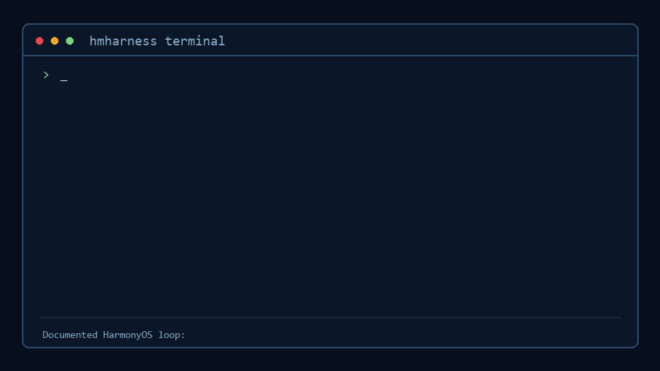

# hmharness

**A self-evolving agent harness for HarmonyOS development, upgraded to a cross-environment Cognitive Runtime.** Zero-dependency kernel + first-class self-evolution + MCP ecosystem borrow + a cognitive layer (world model / calibration / exploration / transfer) — every runtime capability is home-grown or absorbed via standard protocols, never inherited from a parent runtime.

[](https://github.com/swsgbl/hmharness/actions/workflows/ci.yml)
[](https://www.npmjs.com/package/@hmharness/cli)




[中文文档](README.md)

## Feature highlights

| Area | Capability |
|---|---|
| **Agent kernel** | while-loop core, any OpenAI-compatible provider, streaming output with thinking blocks, context budget compression, kernel-level approval gate, append-only session audit |
| **🧠 Cognitive layer** | **World model** (belief table + prediction confidence + error clustering + explainable revision), **five-layer memory** (working/episodic/semantic/procedural/world, append-only + provenance), **goal system** (graph/decompose/drift/high-impact approval), **exploration engine** (uncertainty x information gain x calibration-targeted, falsifiable hypotheses), **RLM workspace** (persistent variables + checkpoints), **skill compiler** (experience -> verifiable skills -> gated promotion), **learning control plane** (nine targets, harness-first), **evolution 2.0 governance** (candidate contracts / sequential gates / canary / reward-hacking detection / immutable audit), **multi-agent governance** (role contracts / shared budgets / cross-process audit), **calibration report** (per-action prediction reliability — the harness's empirically proven value, with self-evolution learning curves) |
| **🌐 Environments** | terminal (native) / harmonyos (hdc bridge) / browser (CDP) / desktop / **ARC-AGI-3** (official REST bridge + frame rendering + vision-model play + scorecards) |
| **HarmonyOS native domain** | Parameterized project scaffolding (multi-page, multi-module, one sentence → any structure), hvigor build, hdc install/launch/logs/uninstall, Cangjie cjpm build, codelinter. **Full emulator lifecycle management without an IDE** |
| **Self-evolution** | Evolution loop (insight mining → proposals → training/holdout double gate → promotion with snapshots → rollback), three-state skill lifecycle, retrieval-based long-term memory, scheduled evolution, evolution audit log; **cross-environment transfer** (explicit abstract-action layer + two-arm controlled experiments, calibration transfer evidence +0.4166) |
| **Ecosystem borrow** | MCP client (stdio + HTTP, 5800+ community servers plug-and-play), `hmh ops` keeper (ecosystem radar; AI only proposes, humans approve before publishing) |
| **Multi-agent** | spawn_agent sub-agents (fresh context, depth limit, shared approvals, audited prefix) + role-contract topology governance |
| **Vision** | see_image (any vision model, multi-provider fallback) + ARC-AGI-3 frame-rendered vision play (model reasoning archived with each action) |
| **Frontends** | CLI / REPL / fullscreen TUI (slash-command palette) / Web (browser streaming, remote approvals, session replay, workspaces, **🧠 cognitive panel with learning curves**) |
| **i18n** | zh / en bilingual UI and system prompts (`--locale=en`) |
| **Native web** | web_search (zero-key) + web_fetch (URL -> readable text) + browser automation (browser_open + desktop vision chain) |
| **Desktop automation** | desktop_screenshot / desktop_click / desktop_type - the see-act-verify loop, approval-gated |
| **Parallel + instant feedback** | concurrent tools (approvals ordered); 3-tier feedback: errors noted instantly -> per-task reflection into memory -> auto evolution every 3 insights; **code-level self-evolution** (sandbox branch + double-sample gate + git revert, kernel loop untouchable) |
| **Session management** | rename / archive / delete (trash, recoverable) on the sidebar history |
| **State safety** | `hmh state backup\|restore` - snapshot and recover the evolution state; **cognitive store export/purge** (`cognitive export/purge`, data governance) |
| **📱 Remote control** | phone pairing (WiFi scan-to-connect, passwordless + cloudflared free tunnel for internet mode + 6-digit pairing PIN + auto-reconnect) |

> **Honest footnote on "self-evolving"**: the canary->impact statistics pipeline is in place (exposed vs control, promote only on >=8 sessions and >=10% delta), but the first 30-day production dataset is still being collected - verdicts, rejected candidates and raw logs are published verbatim on the [evidence page](https://swsgbl.github.io/hmharness/evidence/), protocol in [docs/SELFFEED.md](docs/SELFFEED.md). Until that dataset ships, "gets smarter with use" is a mechanism, not a proven fact.
>
> **Platform status**: Windows-first (HarmonyOS toolchain, emulator, desktop automation and TUI terminal handling are all verified here); macOS/Linux is community-supported (the kernel and evolution loop are pure Node; domain tools degrade gracefully by availability).
>
> **Thirteen-question FAQ**: zero-IDE HarmonyOS development, command-line packaging & signing (hapsigntool localSign and the expired cert template), CI/CD, ArkTS API hallucination defense, whether self-evolution is real, cognitive-layer learning curves, what ARC-AGI-3 actually tests, and phone remote control — every answer cites its source: [website FAQ](https://swsgbl.github.io/hmharness/faq.html) (plus an [llms.txt](https://swsgbl.github.io/hmharness/llms.txt) as an AI-retrieval entry point).

## Quick start

**Option 1: install from npm** (recommended — published as `@hmharness/*`, zero build):

```bash
npm install -g @hmharness/cli     # Node >= 22
hmh init                    # creates ~/.hmharness (config + state dirs)
```

**Option 2: from source** (development / trying it out):

```bash
git clone https://github.com/swsgbl/hmharness.git
cd hmharness
npm install
npm run build
npm link -w @hmharness/cli   # then `hmh ...` works from any directory
hmh init               # creates ~/.hmharness (config + state dirs)
```

**Option 3: KaihongOS / OpenHarmony board** (no npm, read-only rootfs — one command, then add your keys):

```bash
node scripts/install-kaihongos.cjs   # Node >= 22 (any location)
```

Nine real board pitfalls (isolated mount-namespace terminals, read-only rootfs remount, HOME=/ and more) with fixes: **[docs/KAIHONGOS.md](docs/KAIHONGOS.md)** (Chinese).

Point at any OpenAI-compatible provider (edit `~/.hmharness/config.json` or env vars `HMH_BASE_URL / HMH_API_KEY / HMH_MODEL`):

```json
{
  "provider": { "baseUrl": "https://api.example.com/v1", "apiKey": "sk-...", "model": "your-model" }
}
```

Multi-provider routing is optional:

```json
{
  "providers": {
    "a": { "baseUrl": "...", "apiKey": "...", "model": "strong-model" },
    "v": { "baseUrl": "...", "apiKey": "...", "model": "vision-model" }
  },
  "routing": { "chat": "a", "vision": "v", "evolve": "a" }
}
```

## Common commands

```bash
hmh "your task"              # one-shot task (full agent loop, streaming)
hmh                          # interactive REPL (cross-line conversation memory)
hmh tui                      # fullscreen TUI (palette: arrows/wheel/click, /model picker, /lang zh|en; also auto-starts the web UI, --no-web skips)
hmh web start               # web UI as a silent background daemon (no window, survives terminals; stop/status)
hmh web [--port=7788]        # web UI in the foreground (debugging)
hmh resume [id-prefix]       # continue a past session
hmh tools | mcp              # tool inventory / MCP server status
hmh check | devices          # toolchain health check / device list
hmh evolve [--every=30]      # self-evolution cycle (one-shot or resident)
hmh bench | skills           # bench / skill library
hmh ops scan|brief|status    # ecosystem radar
```

Any command accepts `--locale=zh|en`. Dangerous operations go through the approval gate by default (y/N on a TTY, denied headless; `--yes` or `"approval":"auto"` to allow; destructive command patterns are hard-denied).

## Use inside Claude Code / Codex (MCP server mode)

hmharness can serve its HarmonyOS toolchain to any MCP host (Claude Code, Codex, Cursor, ...) as **native MCP tools** - the outer agent calls `harmony_build`, `harmony_api_lookup`, ... directly: no nested agent loop, and every call is permission-gated by the host itself:

```jsonc
// Claude Code: claude mcp add hmharness -- npx -y @hmharness/cli mcp-serve
// or .mcp.json / Codex config:
{ "mcpServers": { "hmharness": { "command": "npx", "args": ["-y", "@hmharness/cli", "mcp-serve"] } } }
```

- Only `harmony_*` domain tools are exposed by default (build / install / logs / signing / API lookup / radar); generic tools (`run_command`, `write_file`, ...) stay private - the host has its own. Narrow further with `HMH_MCP_TOOLS="harmony_build,harmony_ops"`;
- Approval split: the host's permission system asks the user; the destructive-command hard walls inside each tool stay server-side, always on;
- Every external call is appended to `insights/mcp-calls.jsonl` (observation only - the skill gate stays exclusive to native hmh sessions).

> Note: MCP mode is the "HarmonyOS toolbox" outlet; hmh's self-evolution (memory/skills/gates) runs in native `hmh` sessions - the two usages complement each other, see `docs/SELFFEED.md`.

## HarmonyOS flow without an IDE

```text
harmony_project_create(pages+modules) -> harmony_build -> harmony_install
  -> harmony_launch -> harmony_logs                    # device or emulator
harmony_emulator_list|catalog|create|start|stop|delete # full emulator lifecycle
harmony_cjpm_build/test · harmony_lint                 # Cangjie / codelinter
```

Project scaffolding is fully parameterized: one call generates any structure of multi-page + feature HAP + HAR libraries. Emulator management drives the official headless CLI directly — no DevEco Studio required.

## Self-evolution

One `hmh evolve` cycle: read session transcripts → meta-model proposes candidate skills (written to `drafts/`) → **training gate** A/B bench (regression = reject) → promote (auto snapshot) → **holdout gate** re-verifies post-promotion (anti-memorization; regression = instant rollback) → memory distillation (append-only) → everything lands in `evolution/log.jsonl`. Safety constraint: the evolution loop only writes `skills/` and `memory/` — it can never touch configuration or safety settings.

## Repository layout

```
packages/
  kernel/          zero-dependency kernel (registry, loop, provider, chat, config, compression, MCP client)
  evolution/       memory · insights · skill lifecycle · bench (training/holdout) · evolution loop
  domain-harmony/  HarmonyOS domain (devices, toolchain, scaffolding, build, install, run, logs, Cangjie, lint, emulator)
  domain-ops/      ops keeper (ecosystem radar, issue flow)
  agent/           execution layer (base tools, system prompt, spawn, runner)
  cli/  web/       terminal and browser frontends (same event protocol)
```

See [docs/ARCHITECTURE.md](docs/ARCHITECTURE.md), [docs/ROADMAP.md](docs/ROADMAP.md) and [docs/PROVIDERS.md](docs/PROVIDERS.md) (provider presets reference, in Chinese) and [docs/DEVLOG.md](docs/DEVLOG.md) (development log). Settled interaction-design decisions live in [docs/DESIGNS.md](docs/DESIGNS.md) (in Chinese) — check the ledger before changing any UI behavior.

## Contributing

`npm run typecheck && npm test && npm run build` all green, then open a PR (draft mode first). Details in [CONTRIBUTING.md](CONTRIBUTING.md).

## License

[MIT](LICENSE)
